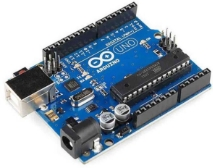
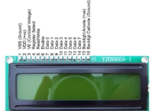
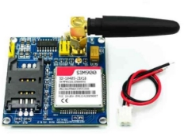
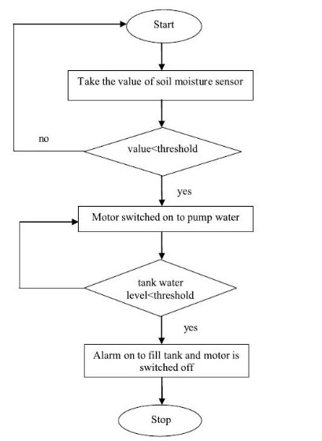
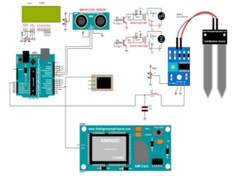

SMART IRRIGATION SYSTEM

**1.Hasan Al Muazzaz**  
Dept Of ECE RUET  
1810038@student.ruet.ac.bd

**_Abstract_— In past few years, automatic irrigation system has seen a rapid growth in terms of technology. At present cost-saving technology, labor-saving is the addressing key issues in irrigation. This report gives a review of these systems based on existing technologies and also proposes an economical and generic automatic irrigation system based on moisture sensors with GSM for irrigation system controller and remote monitoring system. This system has simpler features designed with the objective of low cost and effective with less power consumption using sensors for remote monitoring devices which are monitored via SMS using a GSM module. The system informs user about any abnormal conditions like less moisture content and temperature rise, even concentration of CO2 via SMS from the GSM module to the farmer’s mobile and actions are taken accordingly by the farmer. In future, the farmer will be able to monitor and control the parameter by GSM. [1]\***

**\*Keywords—** GSM, remote monitoring, Sensors, Microcontroller, Agriculture\*

**I**. **INTRODUCTION**

85% of worldwide available water resources is used in agriculture and this percentage will not decrease keeping in mind the rate of population growth and hence leading to high demand of food [5]. Its high time to create and implement new methodologies using smart technologies for sustainable agriculture. In this electronics era, a smarter approach of leading a life should be carried out and thus we have made "Automated Plant Irrigation System" for smarter irrigation. Automated Irrigation System will regulate water flow in soil without much human intervention, while maintaining moisture of the plants[2]. This project automatically turns ON or OFF by detecting the water content in the soil. An automated irrigation system will not only minimize the excess wastage of water but also imply reduction of labor and other overheads [7]. This irrigation system is useful for watering the plants as it calculates the amount of moisture present in the soil and then proceeds to the further commands. We are using a relay module to control the water pump. This system can work automatically and there is no need for interference. [6]

**II**. **OBJECTIVE**

Automatically controlled irrigation of a farm while checking the level of water. The system sends an SMS to the farmer with the status of water and soil moisture.

**III**. **REQUIRED APPARATUS**

Hardware: (Simulation)

A. Arduino Uno.<br>
B. Soil Moisture Sensor.<br>
C. Water pump.<br>
D. LCD display (LM044L).<br>
E. Relay.<br>
F. Ultra-Sonic Sensor.<br>
G. Jump wire.<br>
H. GSM module.<br>

Software:

1. Proteus.
1. Arduino IDE.

<br>

A. _Arduino UNO_



<p style='text-align: justify;'>Arduino is a single card microcontroller designed to make the application more appreciable, that is interactive objects and the surrounding environment. The UNO board of Arduino is a microcontroller based on ATmega328. It has 14 digital input and output pins in which 6 can be used as PWM outputs, a 16 MHz ceramic resonator, an ICSP header,  a  USB  connection,  6  analog  inputs,  a  power connector and a reset button. Contains all the necessary support  controller  required.  It  is  presented  by ATmega16U2  (Atmega8U2  up  to  R2  version) programmed as USB serial converter. It is a simple USB interface system. This allows the interface. This allows the USB interface since it is like a series. The chips on the card connect directly to the USB port and are compatible with the computer as a virtual serial port. The advantage of this configuration is that serial communication is an extremely simple protocol that has been proven over time and that USB  connects  to  modern  computers  and  makes  it comfortable. It is easy to find the microcontroller brain that is the Atmega328 chip. It is an open-source project and there is an advantage to be open source, since it has a large community of people who use it and solve it. This facilitates  the  help  in  debugging  projects.  It  is  very convenient  to  manage  the  energy  inside  and  has  an integrated voltage regulation function. This can also be powered directly from a USB port without an external power supply. It is connected to an external power supply up to 12 V and adjusts the digital pins of the 5v and 3.3v.13 and 6 analog pins. This type of pin allows you to connect the hardware to the UNO board of Arduino externally. Simply connect the electronic devices and sensors to the plugs that correspond to each of these pins and are ready to work. [17] 
</p>

B. _Soil Moisture Sensor_


<p style='text-align: justify;'>
The humidity sensor is used to measure the water content (moisture) of the soil. This sensor reminds the user to irrigate their plants and also controls the moisture content of the soil. It has been widely used in agriculture, irrigation and the land botanical garden (Shahidul Islam et al., 2015). The ground moisture operating voltage is 5 V, the current required is less than 20 mA, the interface is analog type sensors and operate between 10 and 20℃. The soil moisture sensor uses capacitance to measure the dielectric permittivity of the surrounding soil. In the soil,Dielectric permittivity is a function of water content. The sensor creates a voltage proportional to the dielectric permittivity and, therefore, to the water content of the soil. The sensor calculates the average water content over the entire length of the sensor. The soil moisture sensor is used to measure the loss of moisture over time due to evaporation and plants. Monitor soil moisture content to control irrigation in greenhouses and improve bottle biology experiments. The hardware and software needed for the soil moisture sensor is Arduino IDE humidity sensor software, and the Arduino Uno board. The soil moisture brings connected to the VCC% v of Arduino UNO, GND soil moisture and interconnected sensor Arduino UNO and the last door of the A0 sensor connected to the 0 Arduino analogue board. The program will generate the sensor value as output. Take different types of terrain and insert the sensor into the ground. As a result, you will get the value of moisture present in the soil. For demonstration purposes, the user can keep the sensor on the ground. On the serial monitor. Note that the sensor will read the moisture on the floor and show the output.[17]
</p>

C. _Water Pump_
</br>


<p style='text-align: justify;'>For this study a water pump is required, which must be DC, 12V. The DC motor is the commonly used motor and has DC power distribution systems. Some rotors carry magnets and the stator grabs the conductors. The supports are used to allow the rotor to rotate continuously towards its axis.[17]
</p>

<p style='text-align: justify;'>

D. _LCD display (LM044L)_



A 20x4 LCD display is very basic module and is very commonly used in various devices and circuits. These modules are preferred over seven segments and other multi segment LEDs. The reasons being: LCDs are economical; easily programmable; have no limitation of displaying special & even custom characters (unlike in seven segments), animations and so on. A 20x4 LCD means it can display 20 characters per line and there are 4 such lines. In this LCD each character is displayed in 5x7 pixel matrix. This LCD has two registers, namely, Command and Data. This is standard HD44780 controller LCD. There is no change code for interfacing standard 16x2 or 20x4 LCD. Characteristics:

- 20 Characters x 4 Lines.
- Built-in HD44780 Equivalent LCD Controller.
- Works directly with ATMEGA, ARDUINO, PIC and many other microcontroller/kits.
- 4- or 8-bit data I/O interface.
- Low power consumption.
[18]
</p>

E. _Relay_


<p style='text-align: justify;'>
A relay is an electrical main voltage switch. This means that it can be turned on or off, letting the current flow or not. Controlling a relay with Arduino is as simple as
controlling an output like a motor. There are many types of modules, such as single channels, double channels, four channels and eight channels. In relation to the mains voltage, the relays have 3 possible connections. There is a common pin (COM), usually a pin (NO) and a normally closed pin (NC). There is no contact between the common pin and the normally open (NO) pin. We activate the relay to connect the COM pin and the power supply is supplied to a load. There is a contact between the COM pin and the NC pin. A connection between the COM and NC pins is always required, even when the relay is switched off. When we activate the relay, the circuit opens and there is no power supply for a load.[17]

</p>

F. _Ultra-Sonic Sensor_


The HC-SR04 Ultrasonic Distance Sensor is a sensor used for detecting the distance to an object using sonar. It's ideal for any robotics projects to have which require to avoid objects.[20]

G. _Jump wire_

![ref2]

A jump cable is used to connect the test plate, the prototype or the internal circuit with other non-joined instruments.

H. _GSM Module_



A GSM modem or GSM module is a device that uses GSM mobile telephone technology to provide a wireless data link to a network. GSM modems are used in mobile telephones and other equipment that communicates with mobile telephone networks. They use SIMs to identify their device to the network. SIM900A is an ultra-compact and reliable wireless module. This is a complete GSM/GPRS module in a SMT type and designed with a very powerful single-chip processor integrating AMR926EJ-S core, allowing to benefit from small dimensions and cost-effective solutions.[19].

<br>
<br>

1. Proteus

The Proteus Design Suite is a proprietary software tool suite used primarily for electronic design automation. The software is used mainly by electronic design engineers and technicians to create schematics and electronic prints for manufacturing printed circuit boards.

2. Arduino UNO

The Arduino Integrated Development Environment (IDE) is a cross-platform application (for Windows, MacOS, Linux) written in the Java programming language. It is used to write in the java programming language. It is used to write and load programs on the Arduino board. The source code for the IDE is published under the GNU General Public License, version 2. The Arduino IDE supports the C and C ++ language using special code structuring rules. The Arduino IDE provides a software library of the wiring project, which provides many input and output procedures.[18].

IV. **PROPOSED SYSTEM**

An automated irrigation system based on soil moisture sensor and Arduino is proposed to optimize the use of water for farmland and assist the farmer to monitor his field. The structure of the proposed system is illustrated in figure l, the system has a distributed composed of a soil moisture sensor that measures the soil moisture level and send it to the Arduino A0 pin (Input) to monitor the soil condition. An algorithm has been developed with soil moisture intervals that have been programmed into an Arduino to make a decision to irrigate or not, the latter is done provided that the tank is not empty. For this we use a water level sensor, which is used to detect the water level in the tank. If the humidity level is at well-defined intervals, we can know the state of the soil if it is dry or wet, which opens the solenoid valve and thus provides water to irrigate the soil.



Figure Ⅰ: Block Diagram of System

<br>
<br>

_A_. Moisture sensing system
YL-69 soil moisture sensors modules were placed in soil conditions for analysis. The sensor YL-69 is made up of two electrodes. It reads the moisture content around it. A current is passed across the electrodes through the soil and the resistance to the current in the soil determines the soil moisture. If the soil has more water resistance will be low and thus more current will pass through. On the other hand when the soil moisture is low the sensor module outputs a high level of resistance. This sensor has both digital and analogue outputs. Digital output is simple to use but is not as accurate as the analogue output. Since the At mega 328P-PU microcontroller used for the Arduino Uno contains an onboard 10-bit 6-channel analog-to-digital (A/D) converter, the analog input pin of Arduino can read analog signals being sent from the sensor and return binary integers from 0 to 1023. Greater amount of output implies lesser moisture content.[15]

_B_. _Control section_

Information from the sensors is transmitted to the Arduino board. The Arduino board consists of microcontroller ATMEGA328P which is responsible for controlling the switching on/off of the motor on which water sprinklers can be attached. Sensor values from Arduino are transmitted to the GSM-GPRS SIM900A modem. A sim with 3G data pack is inserted into this modem. Values are further transmitted section through the modem. The GSM modem is a highly flexible plug and play quad bandSIM900A GSM modem for direct and easy integration to RS232 applications. It Supports features like Voice, SMS, Data/Fax, GPRS and integrated TCP/IP stack. The TX and RX pins from Arduino are connected to the RX and TX of GSM modem respectively.[3]

C. _Irrigation pump control_

Water pump control was achieved by setting a threshold value at which irrigation should begin. When the sensors detect moisture content before the threshold, the Pump are switched on till the soil is completely moist.[4]

D. _Gsm module control_

The hardware device comprises of moisture sensors, Arduino Uno and GSMGPRS SIM900A modem. The GSM modem is primary responsible for transmitting the data obtained from Arduino to user mobile. This is done using AT commands which are depicted in the following table 1.

TABLE I. AT COMMAND

| **Command**                            |     | **Meaning**                               |
| -------------------------------------- | :-- | ----------------------------------------- |
| AT+CSQ                                 |     | Signal Quality Check                      |
| AT+CGATT                               |     | Attach or Detach from GPRS support        |
| AT+SAPBR= 3,1,\''CONTYPE\'',\''GPRS\'' |     | Setting the SAPBR connection type to GPRS |

| **Command**                                                    | **Meaning**                                               |
| -------------------------------------------------------------- | --------------------------------------------------------- |
| AT+SAPBR= 3,1,\''APN\'',\''airtel.gprs.com\''                  | Setting the APN string                                    |
| AT+SAPBR=1,1                                                   | Setting the SAPBR                                         |
| AT+HTTPPARA=\''URL\'', \''http://smartfarmsiot.orgfree.com \'' | Setting the http para, website which needs to be accessed |
| AT+HTTPACTION=0                                                | Submit the request                                        |
| AT+CIPSEND                                                     | Request initiation of data sending                        |

[16]

E. _Methodology_

The information from sensors is transmitted to Arduino. Then Arduino control the irrigation pump whether on or off if it is succeeded the condition. the moisture content in soil which has been divided into two categories: Low and High. The Pump is to be switched on when the moisture content is low. The threshold values depend on the type of soil used. Also, the information from sonar sensor is transmitted to Arduino. then Arduino also control the water pump to fill up the tank. When the water tank is vacant then irrigation pump will not be on. which is also controlled by Arduino. Here we used threshold value of moisture is 85%. It depends on weather and kind of soil. Which will be selected by the farmer/user. [16]

<p style='text-align: center;'>

V. **SOFTWARE IMPLEMENTATION**

</p>
In this section, software implementation is discussed. For software setup, all simulations are done by Proteus software. Fig. 2 shows the full circuit diagram of the proposed smart irrigation system. [3]



Figure Ⅱ: Simulation of Smart Irrigation System

VI. CODE IMPLEMENTATION OF ARDUINO

`code`

```
#include<LiquidCrystal.h> #include <SoftwareSerial.h>

#define echo 9

#define trigger 10

#define tank_pump 4

#define watering_pump 13 #define moisture_sensor A0 long duration;

int distance;

int moisture_value;

int distance_percent;

int moist_percent; SoftwareSerial SIM900(2, 3); LiquidCrystal lcd(12,11,8,7,6,5);

void setup () {

lcd.begin(20,4);

SIM900.begin(9600); Serial.begin(9600); pinMode(echo,INPUT); pinMode(moisture_sensor,INPUT); pinMode(trigger,OUTPUT); digitalWrite(trigger,LOW); pinMode(watering_pump,OUTPUT); pinMode(tank_pump,OUTPUT); digitalWrite(watering_pump,LOW); digitalWrite(tank_pump,LOW); lcd.setCursor(0,1);

lcd.print(" IRRIGATION PROJECT" ); lcd.setCursor(0,2);

lcd.print(" Hasan Al Muazzaz"); lcd.setCursor(0,3);

lcd.print(" WELCOME");

delay(500);

lcd.clear();

}

void loop(){

digitalWrite(trigger,LOW);

delayMicroseconds(2);

digitalWrite(trigger,HIGH);

delayMicroseconds(10);

digitalWrite(trigger,LOW);

duration=pulseIn(echo,HIGH); distance=duration\*0.017;

distance_percent=map( distance,0,1023,0,100);

moisture_value= analogRead(moisture_sensor);

moist_percent=map(moisture_value,0,1023,0,1 00);

condition();

}

void sms(){

SIM900.print("AT+CMGF=1\r");

SIM900.println("AT + CMGS = \"01405869820\"");// recipient's mobile number

SIM900.println("WATERING PUMP IS OFF"); // message to send

SIM900.println((char)26); // End AT command with a ^Z, ASCII code 26

Serial.println((char)26);

SIM900.println();

}

void sms1(){

SIM900.print("AT+CMGF=1\r");

SIM900.println("AT + CMGS = \"01405869820\"");// recipient's mobile number

SIM900.println("TANK PUMP IS OFF"); // message to send

Serial.println("TANK PUMP IS OFF");

SIM900.println((char)26); // End AT command with a ^Z, ASCII code 26 Serial.println((char)26);

//delay(200);

SIM900.println();

}

void sms2(){

SIM900.print("AT+CMGF=1\r");

SIM900.println("AT + CMGS = \"01405869820\"");// recipient's mobile number

SIM900.println("WATERING PUMP IS ON"); // message to send

Serial.println("WATERING PUMP IS ON"); //delay(200);

SIM900.println((char)26); // End AT command with a ^Z, ASCII code 26 Serial.println((char)26);

//delay(200);

SIM900.println();

}


void sms3(){

SIM900.print("AT+CMGF=1\r");

delay(2000);

SIM900.println("AT + CMGS = \"01405869820");// recipient's mobile number

SIM900.println("TANK PUMP IS ON"); // message to send

Serial.println("TANK PUMP IS ON"); //delay(200);

SIM900.println((char)26); // End AT command with a ^Z, ASCII code 26 Serial.println((char)26);

//delay(200);

SIM900.println();

}

void condition(){

if (distance_percent>65 &&moist_percent<85){

LCD_3(); digitalWrite(tank_pump,LOW); digitalWrite(watering_pump,HIGH); sms1();

sms2();

delay(1000);

}

else if (distance_percent<65 &&moist_percent>85)

{

LCD_2(); digitalWrite(tank_pump,HIGH); digitalWrite(watering_pump,LOW); sms3();

sms();

delay(1000);

}

else if (distance_percent>65 &&moist_percent>85)

{

LCD_4(); digitalWrite(tank_pump,LOW); digitalWrite(watering_pump,LOW);

sms1(); sms(); delay(1000);

}

else if (distance_percent<65 &&moist_percent<85) {

LCD_1(); digitalWrite(tank_pump,HIGH); digitalWrite(watering_pump,HIGH); sms3();

sms2();

delay(1000);

}

}

void LCD_1()

{

lcd.clear();

lcd.setCursor(0,0);

lcd.print("TANK LEVEL= ");

lcd.print(distance_percent);

lcd.print("%");

lcd.setCursor(0,1);

lcd.print("MOIST CONTENT= "); lcd.print(moist_percent);

lcd.print("%");

lcd.setCursor(0,2);

lcd.print("W-PUMP STATUS ");

lcd.print(" ON");

lcd.setCursor(0,3);

lcd.print("T-PUMP STATUS ");

lcd.print(" ON");

}

void LCD_2(){

lcd.clear();

lcd.setCursor(0,0);

lcd.print("TANK LEVEL= ");

lcd.print(distance_percent);

lcd.print("%");

lcd.setCursor(0,1);

lcd.print("MOIST CONTENT= "); lcd.print(moist_percent);

lcd.print("%");

lcd.setCursor(0,2);

lcd.print("W-PUMP STATUS "); lcd.print(" OFF");

lcd.setCursor(0,3);

lcd.print("T-PUMP STATUS ");

lcd.print(" ON");

}

void LCD_3(){

lcd.clear();

lcd.setCursor(0,0);

lcd.print("TANK LEVEL= ");

lcd.print(distance_percent);

lcd.print("%");

lcd.setCursor(0,1);

lcd.print("MOIST CONTENT= "); lcd.print(moist_percent);

lcd.print("%");

lcd.setCursor(0,2);

lcd.print("W-PUMP STATUS "); lcd.print(" ON");

lcd.setCursor(0,3);

lcd.print("T-PUMP STATUS ");

lcd.print(" OFF");

}

void LCD_4(){

lcd.clear();

lcd.setCursor(0,0);

lcd.print("TANK LEVEL= ");

lcd.print(distance_percent);

lcd.print("%");

lcd.setCursor(0,1);

lcd.print("MOIST CONTENT= "); lcd.print(moist_percent);

lcd.print("%");

lcd.setCursor(0,2);

lcd.print("W-PUMP STATUS");

lcd.print(" OFF");

lcd.setCursor(0,3);

lcd.print("T-PUMP STATUS");

lcd.print(" OFF");

}

```

VII. **COST ESMTIMATION**

| **Component**         | **Quantity** | **Price (US $)** |
| --------------------- | ------------ | ---------------- |
| Arduino               | 1 pc         | 11\.00$          |
| GSM Module            | 1 pc         | 12\.00$          |
| LCD display           | 1 pc         | 1\.30$           |
| Relay                 | 2 pcs        | 0\.20$           |
| Power supply 12v      | 1pc          | 2\.50$           |
| Pump/motor 12v        | 2 pcs        | 15\.00$          |
| Ultra-Sonic Sensor    | 1 pc         | 1\.2$            |
| Solar Moisture Sensor | 1 pc         | 12\.00$          |

[9]

**VIII.RESULT**

The values obtained through sensors enable the system to switch the Irrigation pump on and off. A farmer can remotely monitor the irrigation process on the farm. Hence, the system contributed in making a smart farm. Table Ⅲ depicts the readings of the YL-69 soil moisture sensors taken over a period of over half an hour. Table Ⅲ depicts readings from YL-69 soil moisture sensor in soil with initial moisture content 89%. The readings were taken over a period of half an hour to observe the rate at which moisture content in soil is reducing when the Irrigation pump are off. These readings are transmitted to the user if its cross the limit threshold.

TABLE Ⅲ Sensor Readings

| Time (GMT+6) | Sensor (%) | Irrigation Motor |
| ------------ | ---------- | :--------------: |
| 15:53:21     | 89         |       OFF        |
| 16:00:22     | 84         |        ON        |
| 16:11:23     | 78         |        ON        |
| 16:16:44     | 71         |        ON        |
| 16:30:05     | 75         |        ON        |
| 16:34:45     | 80         |        ON        |
| 16:43:06     | 86         |       OFF        |

TABLE Ⅳ Water Tank Height

| Time (GMT+6) | height (%) | Water Motor |
| ------------ | ---------- | ----------- |
| 15:53:21     | 98         | OFF         |
| 16:00:22     | 97         | OFF         |
| 16:11:23     | 85         | OFF         |
| 16:16:44     | 70         | OFF         |
| 16:30:05     | 58         | ON          |
| 16:34:45     | 59         | ON          |
| 16:43:06     | 62         | ON          |
| 16:53:06     | 65         | ON          |
| 16:59:08     | 70         | OFF         |

Table Ⅳ depicts the readings of the height of water tank taken over a period of over an hour. Table Ⅲ
depicts readings from sonar sensor which measure height of water tank with initial height about 98%.

<br>
GRAPH Ⅰ Sensor Reading


GRAPH Ⅱ Water tank height


It can be observed from the graphs Ⅰ that when the moisture sensor value is less than 85% then the Irrigation motor pump is turned on. After a time, soil moisture is increased up to threshold value which is cause for irrigation motor pump turn off. In our system possibility of over irrigation is avoided by turning the Irrigation water pump off as soon as the sensor reading is 85%.

On the other hand, graphs Ⅱ indicate that when the solar sensor value is less than 65% then the water tank motor is turned on. After a time, Height is increased up to threshold value which is cause for water tank motor turn off. In our system possibility of over tank is avoided by turning the water tank pump off as soon as the sensor reading is 65%.

IX. **ADVANTAGES**

This technology is recommended for efficient automated irrigation systems and it may provide a valuable tool for conserving water planning and irrigation scheduling which is extendable to other similar agricultural crops. Maximum absorption of the water by the plant is ensured by spreading the water uniformly using a servo motor. So, there is minimal wastage of water. This system also allows controlling the amount of water delivered to the plants when it is needed based on types of plants by monitoring soil moisture and temperature. This project can be used in large agricultural area where human effort needs to be minimized. Many aspects of the system can be customized and fine-tuned through software for a plant requirement. Here are some advantages;

- the wastage of water can be reduced. Sensors used have high sensitivity and are easy to handle.
- Low maintenance and low power consumption. Can be used for different plant species by making minor changes in the ambient environmental parameters.
- Can be easily modified for improving the setup and adding new features.
- A low-cost system, providing maximum automation.

X. **LIMITATION AND FUTURE SCOPE**

Though the system runs successfully, a few issues are confronted because of this system is that the moisture sensor cannot detect the dampness level for all day long in a handy water system field. [12]

This framework is exceptionally successful, as nowadays innovation is running with time and it is totally helpful with the way of life of the lifestyle of the human being.

To improve the efficiency and effectiveness of the system, the following recommendations can be put into consideration. Option of controlling the water pump can be given to the farmer i.e., he can switch on/off the pump in order to start/stop the process of irrigation without being present at the farm. The farmer may choose to stop the growth of crops or the crops may get damaged due to adverse weather conditions [11]. In such cases farmer may need to stop the system remotely. The idea of using IOT for irrigation can be extended further to other activities in farming such as cattle management, fire detection and climate control. This would minimalize human intervention in farming activities. The objective of this project is fulfilled but there is some update that can be done to make this irrigation system more effective.

- Ambient temperature, light intensity, and humidity can be measured.
- Weather update can be sent through SMS.
- A solar panel can be used as an automatic sun ray tracking system for powering the system.
- As the proposed system is automatic, an ultrasonic sensor can be used to avoid any type of obstacles for perfect operation.

[13]

XI. **CONCLUSION**

In the present era, the farmers use irrigation technique through the manual control, in which the farmers irrigate the land at regular intervals [5]. This process seems to consume more water and results in water wastage. Moreover, in dry areas where there is inadequate rainfall, irrigation becomes difficult. Hence, we require an automatic system that will precisely monitor and control the water requirements in the field. Installing Smart irrigation system saves time and ensures judicious usage of water [8]. Moreover, this architecture uses microcontroller which promises an increase in system life by reducing power consumption. A system to monitor moisture levels in the soil was designed and the project provided an opportunity to study the existing systems, along with their features and drawbacks. The proposed system can be used to switch on/off the water pump according to soil moisture levels thereby automating the process of irrigation which is one of the most time- consuming activities in farming. Agriculture is one of the most water-consuming activities [9]. The system uses information from soil moisture sensors to irrigate soil which helps to prevent over irrigation or under irrigation of soil thereby avoiding crop damage. The farm owner can monitor the process through SMS service. Through

this project it can be concluded that there can be considerable development in farming with the use of IOT and automation. Thus, the system is a potential solution to the problems faced in the existing manual and cumbersome process of irrigation by enabling efficient utilization of water resources.

ACKNOWLEDGEMENT

We would like to extend our sincere thanks to Our project advisor Md Nahiduzzaman and We are highly indebted to Him, Coimbatore for their constant supervision and support.

REFERENCES

1. Dr. Narayan G. Hegde, “Water Scarcity and Security in India”, BAIF Development ReseachFoundation, Pune.
1. Marvin T. Batte, “Changing computer use in agriculture: evidence from Ohio”, Computers and Electronics in Agriculture, Elsevier science publishers, vol. 47, 1–13, 2005
1. Jin Shen, Song Jingling, Han Qiuyan and Yang Yan, “A Remote Measurement and Control System for Greenhouse Based on GSM-SMS”, Electronic Measurement andInstruments, 2007. ICEMI '07. 8th International Conference
1. Indu Gautam and S.R.N Reddy, “Innovative GSM based Remote Controlled Embedded System for Irrigation”, International Journal of Computer Applications Vol. 47 –No.13, June 2012
1. R.Suresh,S.Gopinath,K.Govindaraju,T.Devika,N.SuthanthiraVanitha, “GSM based Automated IrrigationControl using Raingun Irrigation System”, InternationalJournal of Advanced Research in Computer and Communication Engineering Vol. 3, Issue 2, February 2014.
1. Karan Kansara, Vishal Zaveri, Shreyans Shah, Sandip Delwadkar, and Kaushal Jani “Sensor based Automated Irrigation System with IOT: A Technical Review”,(IJCSIT) International Journal of Computer Science and Information Technologies, Vol. 6 (6) , 2015, 5331-5333
1. Thingspeak : https:// thingspeak.com/
1. [https://ieeexplore.ieee.org/abstract/document/8975634/ ](https://ieeexplore.ieee.org/abstract/document/8975634/)
1. [https://ieeexplore.ieee.org/abstract/document/8651993/ ](https://ieeexplore.ieee.org/abstract/document/8651993/)
1. [Design of Remote Monitoring and Control System with Automatic Irrigation System using GSM-Bluetooth (psu.edu) ](https://citeseerx.ist.psu.edu/document?repid=rep1&type=pdf&doi=6311047d4a2328a0c58a47280fe9e5f06158c7d9)[(https://citeseerx.ist.psu.edu/document?repid=rep1&type=pdf&doi=631 1047d4a2328a0c58a47280fe9e5f06158c7d9https://citeseerx.ist.psu.edu/ document?repid=rep1&type=pdf&doi=6311047d4a2328a0c58a47280fe 9e5f06158c7d9)](https://citeseerx.ist.psu.edu/document?repid=rep1&type=pdf&doi=6311047d4a2328a0c58a47280fe9e5f06158c7d9https://citeseerx.ist.psu.edu/document?repid=rep1&type=pdf&doi=6311047d4a2328a0c58a47280fe9e5f06158c7d9)
1. [Smart-Irrigation-System.pdf (smartfasal.in) (http://smartfasal.in/wp/wp- content/uploads/2019/09/Smart-Irrigation-System.pdf)](http://smartfasal.in/wp/wp-content/uploads/2019/09/Smart-Irrigation-System.pdf)
1. Rafael Muñoz-Carpena and Michael D. Dukes, Automatic Irrigation Based on Soil Moisture for Vegetable Crops, IFAS Extension, 2005.
1. K.N.Manjula B.Swathi and D.Sree Sandhya , Intelligent Automatic Plant Irrigation System.
1. Constantinos Marios Angelopoulos, Sotiris Nikoletseas , Georgios Constantinos Theofanopoulos, A Smart System for Garden Watering using Wireless Sensor Networks, MobiWac ,October 31–November 4, 2011.
1. [ijca2017913001-libre.pdf (d1wqtxts1xzle7.cloudfront.net) ](https://d1wqtxts1xzle7.cloudfront.net/69826649/ijca2017913001-libre.pdf?1631926964=&response-content-disposition=inline%3B+filename%3DIOT_based_Smart_Irrigation_System.pdf&Expires=1673254570&Signature=M90nGVgACBty3TKJaYkxLDRcqD-3RPJdxqIEv3JNcBIQ0Da8PF28di-oXNlJvSXIioM4J67~FA4JGPAhe1D~lakdU3i52CA7Y0sJLzKwSkONdP8hDwoYX7d8hnTOfxIivFFwbJ5IbKDTKt4dsEpdXfxfcBa16~UQ3jm2LtjDe-XVgYl0T53sxC3eP7y6Zw8Mfjj1-7CtwdkzAZsUUaZhw4cRpKrkPaKFcnfffktQUVjqtDJnGzaA3cd-GCZQH491lhSvVpEim--8zPTb16T1hT560eENeBRIq5Aw3wzb3pbEIOl24HsaVjv-~WaOErm-E5fnUjBPVE5GmC72bCNfPQ__&Key-Pair-Id=APKAJLOHF5GGSLRBV4ZA)
1. [https://ieeexplore.ieee.org/abstract/document/8250693 ](https://ieeexplore.ieee.org/abstract/document/8250693)
1. [http://www.ijrsset.org/pdfs/v6-i1/5.pdf ](http://www.ijrsset.org/pdfs/v6-i1/5.pdf)
1. [https://www.sunrom.com/p/20x4-lcd-black-on-yellowgreen ](https://www.sunrom.com/p/20x4-lcd-black-on-yellowgreen)
1. [https://www.instructables.com/GSM-SIM900A-With-Arduino/ ](https://www.instructables.com/GSM-SIM900A-With-Arduino/)
1. [https://www.piborg.org/sensors-1136/hc-sr04 ](https://www.piborg.org/sensors-1136/hc-sr04)

[ref1]: Aspose.Words.10ea63cf-2a57-49fb-a7d3-1b676d11915c.001.png
[ref2]: Aspose.Words.10ea63cf-2a57-49fb-a7d3-1b676d11915c.007.jpeg
